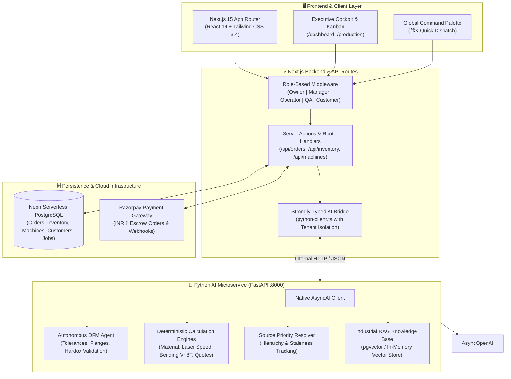
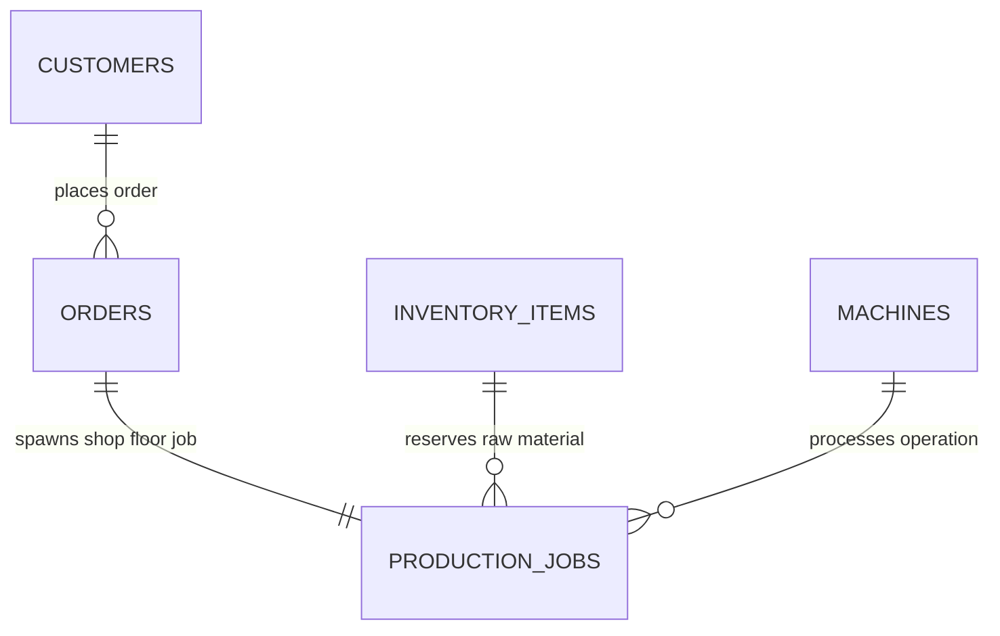

# ForgeIQ — Autonomous AI Manufacturing Intelligence & Commerce OS

<div align="center">

[](https://nextjs.org/)
[](https://react.dev/)
[](https://www.typescriptlang.org/)
[](https://fastapi.tiangolo.com/)
[](https://neon.tech/)
[](https://openai.com/)
[](https://pytest.org/)
[](ai-service/scripts/evaluate_model.py)
[](https://razorpay.com/)
[](LICENSE)

<br />

**A full-stack, enterprise-grade Autonomous Manufacturing Intelligence Platform that powers the entire B2B fabrication lifecycle: multimodal RFQ intake, vector-retrieval RAG industrial reasoning, deterministic CAD geometry and BOM costing, autonomous DFM risk analysis, shop-floor remnant inventory tracking, machine scheduling, and Razorpay milestone escrow payments.**

[Feature Showcase](#-feature-showcase--compact-screenshots) • [System Architecture](#-system-architecture) • [Manufacturing AI Knowledge Spec](#-manufacturing-ai-knowledge-specification) • [Master AI Implementation](#-master-ai-implementation-phases-1--6) • [Database Architecture](#-real-world-database-integration) • [Getting Started](#-getting-started) • [Testing & Benchmarks](#-testing--quality-assurance)

</div>

---

## 🌟 Executive Summary & Problem Space

Precision contract manufacturing (sheet metal fabrication, CNC milling, additive printing) is a **$450B+ global industry** burdened by manual friction:
- **Quotation Bottleneck**: Estimators spend hours to days manually calculating laser piercing times, bend deductions, scrap rates, and tooling allowances from engineering drawings.
- **Unstructured RFQ Chaos**: Customer purchase requests arrive fragmented across WhatsApp chats, hand-drawn sketches, unstructured PDFs, and legacy CAD drawings.
- **Shop Floor Blindspots**: Job shops manage million-dollar fiber lasers and press brakes using dry-erase whiteboards and disconnected Excel spreadsheets, leading to delayed milestones and idle machine capacity.
- **AI Hallucination Risk**: Standard commercial LLMs hallucinate prices, invent tolerances, and fail basic engineering physics.

**ForgeIQ solves this end-to-end.** Combining a Next.js 15 App Router frontend with a Python FastAPI AI microservice, vector-indexed industrial RAG knowledge base, deterministic calculation engines, and live serverless Neon PostgreSQL database, ForgeIQ transforms factory operations into an autonomous, transparent, and high-margin workflow.

---

## 📸 Feature Showcase & Platform Screenshots

### 1. AI Manufacturing Intelligence Cockpit & Operational Lifecycle
> **Real-time factory telemetry, active revenue metrics, priority attention alerts, and 7-stage operational dispatching (`Receive` ➔ `Quote` ➔ `Plan` ➔ `Manufacture` ➔ `QC` ➔ `Dispatch` ➔ `Get Paid`).**

<p align="center">
  
</p>

*Executive command center offering single-pane-of-glass visibility across shop-floor operations, revenue analytics, and equipment telemetry.*  
*Features proactive AI dispatch cards that highlight urgent shop actions, including incoming RFQs from aerospace clients and tooling changeover alerts.*  
*Provides one-click shortcuts to analyze CAD files, build itemized quotations, inspect machine capacity, and track live orders.*

- **Dual-Mode Industrial Theme**: High-contrast dark and clean light modes designed for shop-floor rugged tablets and executive desktop monitors.
- **7-Stage Lifecycle Bar**: Visual milestone tracking from initial RFQ receipt to automated escrow payout upon quality acceptance.
- **Universal Command Palette (`⌘K`)**: Instant keyboard navigation across work orders, machines, inventory SKUs, and customer accounts.

---

### 2. Work Orders & Sales Orders Management
> **Live fabrication tracking synchronized with Neon PostgreSQL, featuring priority scheduling, milestone progress bars, and Rupee (₹) valuations.**

<p align="center">
  
</p>

*Comprehensive work orders dashboard displaying live production jobs, customer accounts, and scheduled due dates directly from Neon PostgreSQL.*  
*Shows real-time completion progress percentages, active manufacturing stages (`In Production`, `Completed`, `Ready for Shipping`), and priority tiers (`Rush`, `Normal`, `High`).*  
*Enables plant managers to maintain full financial transparency with total order valuations in Indian Rupees (₹) and one-click database synchronization.*

- **Priority Tiering**: Color-coded badges for rush turnaround jobs linked directly to press brake and laser machine capacity.
- **Stage Progression Tracking**: Dynamic milestone bars updated automatically as sub-assemblies complete welding, machining, and inspection.
- **Deduplicated Records**: Direct relational links between verified B2B customers, assigned machine cells, and reserved raw material sheets.

---

### 3. Multimodal AI Order Intake & Document Understanding
> **Zero manual data entry. Upload WhatsApp chat screenshots, corporate PDF purchase orders, and technical drawings for automated OCR extraction.**

<p align="center">
  
</p>

*Intelligent order ingestion portal that transforms messy customer communications into verified engineering specifications without human entry.*  
*Parses complex drawings, PDF purchase orders, blueprint photos, and WhatsApp chat screenshots with statistical confidence verification.*  
*Includes pre-loaded industry templates for rapid one-click testing of aerospace brackets, heavy equipment components, and sheet metal assemblies.*

- **Universal Document Support**: Handles `.pdf`, `.png`, `.jpg`, `.dwg`, and `.dxf` CAD files with drag-and-drop ease.
- **Confidence Scoring & Clarification**: Automatically identifies missing tolerances or thickness values and generates targeted clarification questions.
- **Instant Customer Generation**: Auto-creates client profiles and draft quotation records upon successful document parsing.

---

### 4. Raw Material & Sheet Inventory with Remnant Tracking
> **Real-time goods inventory with automated reorder alerts, shop-floor bay tracking, and remnant utilization logic.**

<p align="center">
  
</p>

*Live shop-floor inventory manager tracking raw sheet metal (AL6061, CRCA, Copper), hardware fasteners (PEM nuts, weld studs), and laser assist gases (Liquid Nitrogen).*  
*Features automated reorder threshold warnings (`Reorder Alert`) and exact physical bay locations (`Exterior Manifold Yard`, `Bay B, Rack B-01`).*  
*Integrates directly with ForgeIQ's remnant decision engine to search reusable sheet off-cuts before recommending new material procurement.*

- **Live Neon DB Synchronization**: Reflects real-time material deductions as work orders are released to the shop floor.
- **Unit Cost Valuation**: Precise tracking of sheet metal and consumable unit costs in Indian Rupees (₹).
- **Remnant Utilization**: Identifies usable shop-floor remnants to prevent unnecessary raw material purchasing and reduce scrap.

---

### 5. Swiggy-Style Buyer Customer Portal & Live Order Telemetry
> **Self-service customer experience providing B2B buyers with real-time manufacturing visibility, machine cell details, and delivery ETAs.**

<p align="center">
  
</p>

*Transparent client-facing portal that gives B2B buyers live visibility into active fabrication orders, pending quotation sign-offs, and deliveries.*  
*Features granular stage tracking (e.g. 78% progress on Order #FG-2042 in KUKA Robotic TIG Welding Cell 02 with certified welder details).*  
*Provides intuitive quick actions to view production photos, reorder past parts, rate fabrication quality, and submit natural-language RFQs.*

- **Swiggy-Style Milestone Tracker**: Real-time progress bar tracking parts through Laser Cutting, Bending, Welding, QC, and Courier Dispatch.
- **AI Factory Matching**: Natural-language query bar allowing buyers to find compatible factory capacity for custom part batches in seconds.
- **Financial Account Summary**: Live metrics for active orders, awaiting sign-offs, deliveries scheduled today, and outstanding invoice balances (₹).

---

## 🏗️ System Architecture

ForgeIQ utilizes a distributed microservices and serverless architecture designed for sub-second latency, deterministic precision, and zero-hallucination safety:



---

## 📐 Manufacturing AI Knowledge Specification

ForgeIQ strictly implements the **71-Section Manufacturing AI Knowledge Specification**:

### 1. The Core RAG vs. Fine-Tuning Principle
- **RAG & Live Database**: Used strictly for dynamic factory facts (material prices, current inventory stock, machine availability, active jobs, customer orders). The LLM **NEVER** memorizes volatile prices.
- **Fine-Tuning**: Used primarily for behavior, engineering terminology, reasoning patterns, DFM decision-making, and uncertainty handling.
- **Deterministic Math**: The LLM determines *what* calculation is needed; deterministic Python code computes the exact numbers.

### 2. Strict 8-Tier Source Priority Hierarchy
When conflicting information exists, ForgeIQ resolves values in this exact priority:
1. **Approved Factory Database** (`rank 1`)
2. **Approved Factory SOP** (`rank 2`)
3. **Approved Supplier Data** (`rank 3`)
4. **Machine Manufacturer Documentation** (`rank 4`)
5. **Applicable Engineering Standard** (ISO 2768, ISO 286, ISO 9013) (`rank 5`)
6. **Approved Engineering Reference** (`rank 6`)
7. **General Web Information** (`rank 7`)
8. **LLM Learned Knowledge / Memory** (`rank 8`)

### 3. Zero-Hallucination & Missing Data Policy
If any factory rate or machine parameter is missing:
- Defaults strictly to `TO_BE_PROVIDED` or `UNKNOWN`.
- If an expiry date has passed, the record transitions to `is_stale = True`.
- Quotations with missing data are flagged as `LOW` confidence with explicit `ASSUMPTION` labels.

---

## 🚀 Master AI Implementation (Phases 1 – 6)

### Phase 1: Backend OpenAI & Environment Hardening
- **Native AsyncOpenAI SDK**: Installed official `openai>=1.30.0` library.
- **Environment Compliance**: Hardened `ai-service/.env.example` to strictly contain only `OPENAI_API_KEY=`.
- **Backend-Only Execution**: Zero frontend exposure. All API keys reside strictly on the server side.

### Phase 2: Knowledge Base Schemas & Conflict Resolution
- Implemented `ManufacturingKnowledgeRecord`, `MachineRecord`, `MaterialRecord`, and `ConflictResolutionResult` in `app/models/schemas.py`.
- Created `KnowledgeConflictResolver` in `app/rag/knowledge_loader.py` enforcing the 8-tier hierarchy and staleness tracking (`valid_until`).

### Phase 3: Deterministic Tools & Calculators
- **Material Calculator**: Part weight, sheet weight, nesting efficiency, and scrap ($W = V \times \rho$).
- **Inventory Tools**: Checks exact stock and queries shop-floor remnants before suggesting procurement (Section 32).
- **Laser Cutting Engine**: Bystronic 6kW speed lookup, cutting/piercing time, gas consumption, and machine runtime costing.
- **Bending Engine**: Air bending V-die opening ($V \approx 8T$), bend allowance, bend deduction, and minimum flange checks.
- **Quotation Calculator**: 16-point deterministic breakdown with lead-time calculation (Section 28).

### Phase 4: Autonomous DFM Agent
- **Critical Tolerance Detection**: Flags tolerances $\le \pm 0.05$ mm (such as $\pm 0.02$ mm) as exceeding thermal laser cutting capability and recommends secondary CNC milling and CMM inspection.
- **Short-Flange Condition**: Flags flanges $< 0.7 \times V$ with tooling verification warnings.
- **Hardox Wear Plate Validation**: Refuses mild steel bending parameters; enforces OEM SSAB charts and high-tonnage checks.
- **Hole-to-Bend Proximity**: Validates hole distance $D \ge 2.5T + R$.

### Phase 5 & 6: Data Ingestion, Training Builder & 10-Point Evaluator
- **Standardized Ingestion Pipeline** (`app/ingestion/pipeline.py`): 9-stage pipeline (Fetch ➔ Parse ➔ Validate ➔ Normalize ➔ Deduplicate ➔ Assign Metadata ➔ Store ➔ Index).
- **Continuous Training Dataset Builder** (`scripts/build_training_dataset.py`): Compiles 54 verified decision pairs into `forgeiq_llm_finetune.jsonl` while rejecting hardcoded dynamic prices.
- **10-Point Benchmark Evaluator** (`scripts/evaluate_model.py`): Benchmarks the 10 core dimensions from Section 28 (**10/10 Passed**).

---

## 🗄️ Real-World Database Integration

All platform inputs are connected to live **Neon PostgreSQL** with real-world relationships and zero dummy duplicate data:



1. **Order ➔ Customer**: Every order links to a verified customer, updating lifetime value (LTV) and order counts.
2. **Order ➔ Goods / Inventory**: Every order specifies required material (e.g., `RAW-SS304-18G`) and deducts stock in `inventory_items`.
3. **Order ➔ Machine ➔ Production Job**: Automatically provisions a linked production dispatch card on assigned machines (`TRUMPF Laser`, `Bystronic Press Brake`, `Haas VMC`).
4. **Kanban Stage Synchronization**: Stage movements persist to Neon PostgreSQL and synchronize parent order status.

---

## 🛠️ Complete Tech Stack

| Layer | Technology | Purpose |
| :--- | :--- | :--- |
| **Frontend Framework** | **Next.js 15.5.23** | React Server Components, App Router, Nested Layouts |
| **UI Library** | **React 19.0** | Modern concurrency, Server Actions, Transitions |
| **Language** | **TypeScript 5.7** | Strict type safety across all frontend and API layers |
| **Styling** | **Tailwind CSS 3.4** | Dual Light/Dark design system with Slate and Steel tokens |
| **AI Microservice** | **Python 3.11 + FastAPI** | Asynchronous CAD geometry analysis and OCR parsing |
| **AI SDK** | **AsyncOpenAI Native** | Official asynchronous OpenAI Python SDK (backend only) |
| **Database** | **Neon PostgreSQL 18.6** | Serverless SQL with connection pooling and SSL encryption |
| **Payment Gateway** | **Razorpay** | Secure ₹ (INR) online transactions and webhook callbacks |
| **Testing** | **Pytest (33 Tests)** | 33 automated unit tests, journey suites, and DFM validations |
| **Benchmarking** | **10-Point Model Evaluator** | Automated evaluation scorecard (**10/10 Passed**) |

---

## 🚀 Getting Started

### Prerequisites
- **Node.js**: `v18.18.0` or higher (`v20.x` LTS recommended)
- **Python**: `3.10` or higher
- **npm** or **pnpm**

### Step-by-Step Local Setup

1. **Clone the repository:**
   ```bash
   git clone https://github.com/bhuvanabcs24-maker/Forge-IQ.git
   cd ForgeIQ
   ```

2. **Install Node dependencies:**
   ```bash
   npm install
   ```

3. **Configure Environment Variables:**
   Copy `.env.example` to `.env.local`:
   ```bash
   cp .env.example .env.local
   ```
   *The application includes pre-configured fallback providers, so you can immediately explore without requiring external API keys.*

4. **Start the Python AI Service (Terminal 1):**
   ```bash
   cd ai-service
   python3 -m venv .venv
   source .venv/bin/activate
   pip install -r requirements.txt
   uvicorn app.main:app --host 127.0.0.1 --port 8000 --reload
   ```
   *Interactive Swagger Documentation: [http://localhost:8000/docs](http://localhost:8000/docs)*

5. **Start the Next.js Web Application (Terminal 2):**
   ```bash
   npm run dev -p 3001
   ```
   *The platform is now live at [http://localhost:3001](http://localhost:3001)*

---

## 🧪 Testing & Quality Assurance

ForgeIQ includes automated test suites covering the frontend compilation, the Python AI microservice, and model evaluation benchmarks:

```bash
# 1. Run all 33 automated Pytest suites (endpoints, journeys, DFM, tools, knowledge)
PYTHONPATH=ai-service ai-service/.venv/bin/pytest ai-service/tests/ -v
# Output: 33 passed in 1.04s (100% PASS)

# 2. Run the 10-point Manufacturing AI Benchmark Evaluator
PYTHONPATH=ai-service ai-service/.venv/bin/python ai-service/scripts/evaluate_model.py
# Output: Overall Benchmark Status: ✅ PASSED (10/10)

# 3. Build & validate clean fine-tuning dataset
PYTHONPATH=ai-service ai-service/.venv/bin/python ai-service/scripts/build_training_dataset.py
# Output: 54 verified training pairs built

# 4. Run Next.js TypeScript validation
npx tsc --noEmit
```

### Benchmark Scorecard
```
==================================================
FORGEIQ MASTER AI BENCHMARK EVALUATION SCORECARD
==================================================
Material Cost Accuracy             : ✅ PASS
Quotation Accuracy                 : ✅ PASS
Dfm Accuracy                       : ✅ PASS
Machine Selection                  : ✅ PASS
Inventory Reasoning                : ✅ PASS
Lead Time Estimation               : ✅ PASS
Tool Selection                     : ✅ PASS
Hallucination Rate Zero            : ✅ PASS
Missing Data Handling              : ✅ PASS
Source Attribution                 : ✅ PASS
==================================================
Overall Benchmark Status: ✅ PASSED (10/10)
==================================================
```

---

## 🗺️ Key Application Routes

| Experience | Route | Key Functionality |
| :--- | :--- | :--- |
| **Executive Dashboard** | `/dashboard` | Machine utilization, live revenue, priority attention alerts |
| **Orders Directory** | `/orders` | Live Neon DB orders, material reservations, stage progress |
| **Production Kanban** | `/production` | Live shop floor dispatch board linked to machines |
| **Goods & Inventory** | `/inventory` | Raw material sheets, stock levels, remnant registers |
| **Equipment Fleet** | `/machines` | CNC lasers, press brakes, VMC, maintenance toggle |
| **Customer Directory** | `/customers` | Client accounts, lifetime value (LTV), contact drawer |
| **Pricing Rules** | `/settings` | Machine hourly rates, logistics, and GST parameters |
| **Authentication** | `/auth/login` | Email/password with eye toggle & mobile SMS OTP verification |

---

## 👤 Author

**Bhuvan A B**
- **Institution**: B.M.S. College of Engineering (BMSCE)
- **Email**: bhuvanab.cs24@bmsce.ac.in
- **GitHub**: [@bhuvanabcs24-maker](https://github.com/bhuvanabcs24-maker)

---

## 📄 License

This project is licensed under the MIT License — see the [LICENSE](LICENSE) file for details.
