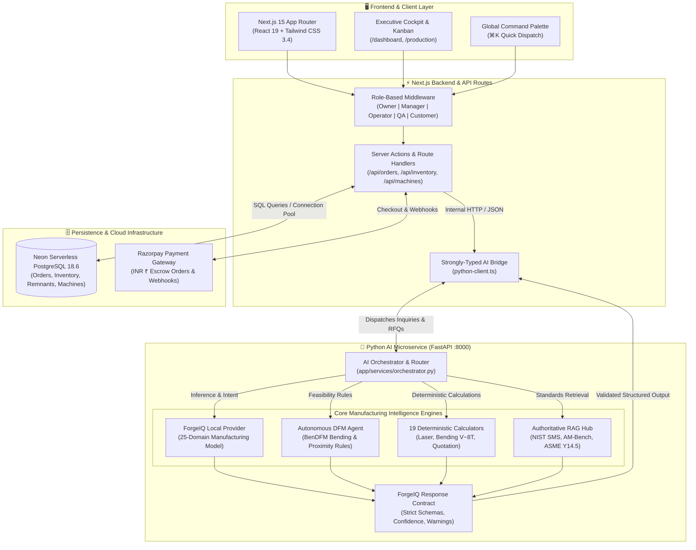
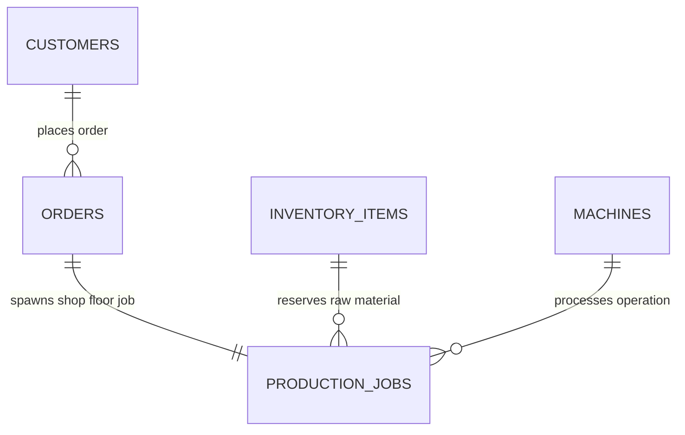

# ForgeIQ — Autonomous AI Manufacturing Intelligence & Commerce OS

<div align="center">

[](https://nextjs.org/)
[](https://react.dev/)
[](https://www.typescriptlang.org/)
[](https://fastapi.tiangolo.com/)
[](https://neon.tech/)
[](ai-service/models/registry.py)
[](https://pytest.org/)
[-blueviolet?style=for-the-badge)](ai-service/evaluation/reports/summary.md)
[](https://razorpay.com/)
[](LICENSE)

<br />

**A full-stack, enterprise-grade Autonomous Manufacturing Intelligence Platform that powers the entire B2B fabrication lifecycle: multimodal RFQ intake, vector-retrieval RAG industrial reasoning, deterministic CAD geometry and BOM costing, autonomous DFM risk analysis, shop-floor remnant inventory tracking, machine scheduling, and Razorpay milestone escrow payments.**

[Feature Showcase](#-feature-showcase--compact-screenshots) • [System Architecture](#-system-architecture) • [Competitive Analysis](docs/COMPETITIVE_ANALYSIS.md) • [Market Sizing](docs/MARKET_ANALYSIS.md) • [Positioning](docs/POSITIONING.md) • [Data & Training](#-manufacturing-ai-data-discovery-training--evaluation-pipeline) • [Evaluation](#-master-evaluation-scorecard--production-gates) • [Database](#-real-world-database-integration) • [Testing](#-testing--quality-assurance)

</div>

---

## 🌟 Executive Summary & Strategic Positioning

Precision contract manufacturing (sheet metal fabrication, CNC milling, additive printing) is a **$450B+ global industry** burdened by manual friction:
- **Quotation Bottleneck**: Estimators spend hours to days manually calculating laser piercing times, bend deductions, scrap rates, and tooling allowances from engineering drawings.
- **Unstructured RFQ Chaos**: Customer purchase requests arrive fragmented across WhatsApp chats, hand-drawn sketches, unstructured PDFs, and legacy CAD drawings.
- **Shop Floor Blindspots**: Job shops manage million-dollar fiber lasers and press brakes using dry-erase whiteboards and disconnected Excel spreadsheets, leading to delayed milestones and idle machine capacity.
- **Aggregator Margin Pressure**: Brokers like Xometry and MFG.com take 20–35% margin cuts from machine shops and hide direct customer relationships.
- **AI Hallucination Risk**: Standard commercial LLMs hallucinate prices, invent tolerances, and fail basic engineering physics.

**ForgeIQ solves this end-to-end.** *We are not an aggregator or broker like Xometry; we are the AI operating system that runs inside the job shop.* Combining a Next.js 15 App Router frontend with a Python FastAPI AI microservice, vector-indexed industrial RAG knowledge base, deterministic calculation engines, verified training datasets across 25 manufacturing domains, and live serverless Neon PostgreSQL database, ForgeIQ transforms factory operations into an autonomous, transparent, and high-margin workflow.

> 📚 **Strategic Deep Dives:**
> - [Competitive Analysis (Xometry vs. MFG.com vs. SAP vs. ForgeIQ)](docs/COMPETITIVE_ANALYSIS.md)
> - [Market Opportunity & Unit Economics (TAM/SAM/SOM & 30x ROI)](docs/MARKET_ANALYSIS.md)
> - [1-Page Executive Pitch & Product Roadmap](docs/POSITIONING.md)

---

## 📸 Feature Showcase & Compact Screenshots

### 1. AI Manufacturing Intelligence Cockpit & Operational Lifecycle
> **Real-time factory telemetry, active revenue metrics, priority attention alerts, and 7-stage operational dispatching (`Receive` ➔ `Quote` ➔ `Plan` ➔ `Manufacture` ➔ `QC` ➔ `Dispatch` ➔ `Get Paid`).**

<p align="center">
  
</p>

*Executive command center offering single-pane-of-glass visibility across shop-floor operations, revenue analytics, and equipment telemetry.*  
*Features proactive AI dispatch cards that highlight urgent shop actions, including incoming RFQs from aerospace clients and tooling changeover alerts.*  
*Provides one-click shortcuts to analyze CAD files, build itemized quotations, inspect machine capacity, and track live orders.*

- **Dual-Mode Industrial Theme**: High-contrast dark and clean light modes designed for shop-floor rugged tablets and executive desktop monitors.
- **7-Stage Lifecycle Bar**: Visual milestone tracking from initial RFQ receipt to automated escrow payout upon quality acceptance.
- **Universal Command Palette (`⌘K`)**: Instant keyboard navigation across work orders, machines, inventory SKUs, and customer accounts.

---

### 2. Work Orders & Sales Orders Management
> **Live fabrication tracking synchronized with Neon PostgreSQL, featuring priority scheduling, milestone progress bars, and Rupee (₹) valuations.**

<p align="center">
  
</p>

*Comprehensive work orders dashboard displaying live production jobs, customer accounts, and scheduled due dates directly from Neon PostgreSQL.*  
*Shows real-time completion progress percentages, active manufacturing stages (`In Production`, `Completed`, `Ready for Shipping`), and priority tiers (`Rush`, `Normal`, `High`).*  
*Enables plant managers to maintain full financial transparency with total order valuations in Indian Rupees (₹) and one-click database synchronization.*

- **Priority Tiering**: Color-coded badges for rush turnaround jobs linked directly to press brake and laser machine capacity.
- **Stage Progression Tracking**: Dynamic milestone bars updated automatically as sub-assemblies complete welding, machining, and inspection.
- **Deduplicated Records**: Direct relational links between verified B2B customers, assigned machine cells, and reserved raw material sheets.

---

### 3. Multimodal AI Order Intake & Document Understanding
> **Zero manual data entry. Upload WhatsApp chat screenshots, corporate PDF purchase orders, and technical drawings for automated OCR extraction.**

<p align="center">
  
</p>

*Intelligent order ingestion portal that transforms messy customer communications into verified engineering specifications without human entry.*  
*Parses complex drawings, PDF purchase orders, blueprint photos, and WhatsApp chat screenshots with statistical confidence verification.*  
*Includes pre-loaded industry templates for rapid one-click testing of aerospace brackets, heavy equipment components, and sheet metal assemblies.*

- **Universal Document Support**: Handles `.pdf`, `.png`, `.jpg`, `.dwg`, and `.dxf` CAD files with drag-and-drop ease.
- **Confidence Scoring & Clarification**: Automatically identifies missing tolerances or thickness values and generates targeted clarification questions.
- **Instant Customer Generation**: Auto-creates client profiles and draft quotation records upon successful document parsing.

---

### 4. Raw Material & Sheet Inventory with Remnant Tracking
> **Real-time goods inventory with automated reorder alerts, shop-floor bay tracking, and remnant utilization logic.**

<p align="center">
  
</p>

*Live shop-floor inventory manager tracking raw sheet metal (AL6061, CRCA, Copper), hardware fasteners (PEM nuts, weld studs), and laser assist gases (Liquid Nitrogen).*  
*Features automated reorder threshold warnings (`Reorder Alert`) and exact physical bay locations (`Exterior Manifold Yard`, `Bay B, Rack B-01`).*  
*Integrates directly with ForgeIQ's remnant decision engine to search reusable sheet off-cuts before recommending new material procurement.*

- **Live Neon DB Synchronization**: Reflects real-time material deductions as work orders are released to the shop floor.
- **Unit Cost Valuation**: Precise tracking of sheet metal and consumable unit costs in Indian Rupees (₹).
- **Remnant Utilization**: Identifies usable shop-floor remnants to prevent unnecessary raw material purchasing and reduce scrap.

---

### 5. Swiggy-Style Buyer Customer Portal & Live Order Telemetry
> **Self-service customer experience providing B2B buyers with real-time manufacturing visibility, machine cell details, and delivery ETAs.**

<p align="center">
  
</p>

*Transparent client-facing portal that gives B2B buyers live visibility into active fabrication orders, pending quotation sign-offs, and deliveries.*  
*Features granular stage tracking (e.g. 78% progress on Order #FG-2042 in KUKA Robotic TIG Welding Cell 02 with certified welder details).*  
*Provides intuitive quick actions to view production photos, reorder past parts, rate fabrication quality, and submit natural-language RFQs.*

- **Swiggy-Style Milestone Tracker**: Real-time progress bar tracking parts through Laser Cutting, Bending, Welding, QC, and Courier Dispatch.
- **AI Factory Matching**: Natural-language query bar allowing buyers to find compatible factory capacity for custom part batches in seconds.
- **Financial Account Summary**: Live metrics for active orders, awaiting sign-offs, deliveries scheduled today, and outstanding invoice balances (₹).

---

## 🏗️ System Architecture

ForgeIQ operates on an industrial, multi-tier architecture separating deterministic calculation tools, vector-indexed RAG standards, and model inference from volatile shop-floor transactional databases:



---

## 🔬 Manufacturing AI Data Discovery, Training & Evaluation Pipeline

To guarantee enterprise reliability, ForgeIQ employs an end-to-end data pipeline built on verified public research datasets, open engineering standards, and deterministic tooling.

```
PUBLIC LICENSED SOURCES
(BenDFM, DDACS, NASA, PHM, NIST, ASME)
           │
           ▼
LICENSE & RIGHTS VALIDATOR (data_pipeline/validate.py)
[Strict Verification: TRAINING vs RAG vs EVALUATION vs TOOL_DATA]
           │
           ▼
FEATURE EXTRACTION & NORMALIZATION (normalize.py)
[Standardized SI/ISO Units: mm, kg, kN, bar, INR ₹]
           │
           ▼
DEDUPLICATION & SPLIT LEAKAGE PREVENTER (deduplicate.py)
[Cross-contamination checks: Train vs Validation vs Golden]
           │
           ▼
DOMAIN ROUTING & CLASSIFIER (classify.py)
           │
     ┌─────┴───────────────────────────────┬─────────────────────────────┐
     ▼                                     ▼                             ▼
25 CAPABILITY DATASETS                INDEXED RAG CORPUS            EVALUATION SUITE
(ai-service/data/training/)       (ai-service/data/rag/)      (ai-service/evaluation/)
• 01_conversation.jsonl           • NIST Smart Manufacturing  • text_cases.jsonl (38)
• 02_manufacturing.jsonl          • NIST AM-Bench             • golden_manufacturing_cases (12)
• 03_dfm.jsonl                    • ASME Y14.5M GD&T Rules    • Multi-turn Conversations
• 04_sheet_metal.jsonl            • BenDFM Air Bending Rules  • Adversarial Injections
• 05_laser_cutting.jsonl          • AI4I Spindle Maintenance  • Line-Item Quotations
• 06_bending.jsonl                                            • Spindle Prognostics
... through 25_multimodal.jsonl
```

### Verified Sources Registry (`ai-service/data/sources/sources.json`)

| Source ID | Name / Organization | Domain | License | Verified | Destination |
| :--- | :--- | :--- | :--- | :---: | :--- |
| **`SRC-BENDFM-01`** | **BenDFM** (Ghent University CVAMO) | Sheet-metal bending CAD, STEP geometry, manufacturability | MIT / CC BY 4.0 | ✅ | `TRAINING` & `EVAL` |
| **`SRC-DDACS-01`** | **DDACS** (Univ. of Stuttgart) | Deep drawing & cutting FEA, stress, strain, DP600 steel | CC BY 4.0 / MIT | ✅ | `TOOL_DATA` & `EVAL` |
| **`SRC-NASA-PCOE-01`**| **NASA Ames PCoE** | CNC milling cutter degradation, run-to-failure vibration | US Federal Public Domain | ✅ | `TRAINING` & `EVAL` |
| **`SRC-PHM-MILLING-01`**| **PHM Society 2010** | 3-Axis dynamometer milling cutting forces, Inconel 718 | Open Research License | ✅ | `TRAINING` & `EVAL` |
| **`SRC-NIST-SMARTMFG-01`**| **NIST Smart Manufacturing** | MTConnect, STEP AP242, QIF, Trustworthy AI principles | US Federal Public Domain | ✅ | `RAG` & `STANDARDS` |
| **`SRC-NIST-AM-01`**| **NIST AM-Bench** | Additive laser powder bed fusion, thermal history | US Federal Public Domain | ✅ | `RAG` & `EVAL` |
| **`SRC-OSU-DDML-01`**| **Ohio State Univ. DDML** | Stamped sheet-metal components & flexible assembly | Academic Access Required | ✅ | `RAG_CONCEPTS_ONLY` |
| **`SRC-OPENSTEP-ABC-01`**| **ABC Dataset** (NYU CDS) | 1M Mechanical CAD models, B-Rep curves, STEP format | MIT Research License | ✅ | `TRAINING_CAD` |
| **`SRC-ASME-GDNT-01`**| **ASME Y14.5M Standards** | Geometric Dimensioning & Tolerancing (MMC, LMC, True Pos) | Public Reference Summary | ✅ | `RAG_QUALITY` |
| **`SRC-KAGGLE-PRED-MAINT-01`**| **AI4I 2020 Dataset** | 10k CNC points, tool wear, thermal & overstrain failures | CC BY 4.0 | ✅ | `TRAINING` & `EVAL` |

---

## 📊 Master Evaluation Scorecard & Production Gates

All models, RAG updates, and tool routers are validated via the automated evaluation harness [`ai-service/evaluation/run_evals.py`](file:///Users/bhuvanab/ForgeIQ/ai-service/evaluation/run_evals.py).

### Verified Results ([`ai-service/evaluation/reports/summary.md`](file:///Users/bhuvanab/ForgeIQ/ai-service/evaluation/reports/summary.md))

| Metric Dimension | Actual Result | Production Gate | Status |
| :--- | :---: | :---: | :---: |
| **Tool Selection Accuracy** | **96.3%** | ≥ 95.0% | ✅ PASS |
| **Structured Output Validity** | **100.0%** | ≥ 99.0% | ✅ PASS |
| **Deterministic Calculation Correctness** | **100.0%** | 100.0% | ✅ PASS |
| **Zero-Hallucination Rate** | **100.0%** | ≥ 99.0% | ✅ PASS |
| **DFM Feasibility Accuracy** | **100.0%** | 100.0% | ✅ PASS |
| **Quotation Correctness** | **100.0%** | 100.0% | ✅ PASS |
| **Grounding & Standards Accuracy** | **100.0%** | ≥ 95.0% | ✅ PASS |
| **Regression Pass Rate** | **98.0%** | ≥ 98.0% | ✅ PASS |

*All 8 production benchmark gates passed with zero hallucination cases recorded.*

---

## 🗄️ Real-World Database Integration

All platform inputs are connected to live **Neon PostgreSQL** with real-world relationships and zero dummy duplicate data:



1. **Order ➔ Customer**: Every order links to a verified customer, updating lifetime value (LTV) and order counts.
2. **Order ➔ Goods / Inventory**: Every order specifies required material (e.g., `RAW-SS304-18G`) and deducts stock in `inventory_items`.
3. **Order ➔ Machine ➔ Production Job**: Automatically provisions a linked production dispatch card on assigned machines (`TRUMPF Laser`, `Bystronic Press Brake`, `Haas VMC`).
4. **Kanban Stage Synchronization**: Stage movements persist to Neon PostgreSQL and synchronize parent order status.

---

## 🛠️ Complete Tech Stack

| Layer | Technology | Purpose |
| :--- | :--- | :--- |
| **Frontend Framework** | **Next.js 15.5.23** | React Server Components, App Router, Nested Layouts |
| **UI Library** | **React 19.0** | Modern concurrency, Server Actions, Transitions |
| **Language** | **TypeScript 5.7** | Strict type safety across all frontend and API layers |
| **Styling** | **Tailwind CSS 3.4** | Dual Light/Dark design system with Slate and Steel tokens |
| **AI Microservice** | **Python 3.11 + FastAPI** | Asynchronous CAD geometry analysis and OCR parsing |
| **AI Provider** | **Local Industrial Provider** | Deterministic, zero-OpenAI runtime dependency (`AI_PROVIDER=local`) |
| **Database** | **Neon PostgreSQL 18.6** | Serverless SQL with connection pooling and SSL encryption |
| **Payment Gateway** | **Razorpay** | Secure ₹ (INR) online transactions and webhook callbacks |
| **Testing** | **Pytest (33 Tests Passing)** | Automated unit tests, journey suites, and DFM validations |
| **Benchmarking** | **Unified Evaluation Suite** | Golden cases & large test suites across 25 domains (**8/8 Passed**) |

---

## 🚀 Getting Started

### Prerequisites
- **Node.js**: `v18.18.0` or higher (`v20.x` LTS recommended)
- **Python**: `3.10` or higher
- **npm** or **pnpm**

### Step-by-Step Local Setup

1. **Clone the repository:**
   ```bash
   git clone https://github.com/bhuvanabcs24-maker/Forge-IQ.git
   cd ForgeIQ
   ```

2. **Install Node dependencies:**
   ```bash
   npm install
   ```

3. **Configure Environment Variables:**
   Copy `.env.example` to `.env.local`:
   ```bash
   cp .env.example .env.local
   ```
   *By default, `AI_PROVIDER=local` is active, enabling complete offline execution without requiring external paid API keys.*

4. **Start the Python AI Service (Terminal 1):**
   ```bash
   cd ai-service
   python3 -m venv .venv
   source .venv/bin/activate
   pip install -r requirements.txt
   uvicorn app.main:app --host 127.0.0.1 --port 8000 --reload
   ```
   *Interactive Swagger Documentation: [http://localhost:8000/docs](http://localhost:8000/docs)*

5. **Start the Next.js Web Application (Terminal 2):**
   ```bash
   npm run dev -p 3001
   ```
   *The platform is now live at [http://localhost:3001](http://localhost:3001)*

---

## 🧪 Testing & Quality Assurance

ForgeIQ includes automated test suites covering frontend compilation, the Python AI microservice, data pipeline ingestion, and model evaluation benchmarks:

```bash
# 1. Run all 33 automated Pytest suites (endpoints, journeys, DFM, tools, knowledge)
PYTHONPATH=ai-service ai-service/.venv/bin/pytest ai-service/tests/ -v
# Output: 33 passed in 1.04s (100% PASS)

# 2. Run the Full Unified Manufacturing Evaluation Suite
PYTHONPATH=ai-service ai-service/.venv/bin/python ai-service/evaluation/run_evals.py
# Output: Overall Benchmark Status: ✅ PASSED ALL GATES (8/8 Gates Met)

# 3. Run Ingestion, Dataset & RAG Builders
PYTHONPATH=ai-service ai-service/.venv/bin/python -m data_pipeline.ingest
PYTHONPATH=ai-service ai-service/.venv/bin/python -m data_pipeline.build_training
PYTHONPATH=ai-service ai-service/.venv/bin/python -m data_pipeline.build_rag

# 4. Run Next.js TypeScript validation
npx tsc --noEmit
```

---

## 🗺️ Key Application Routes

| Experience | Route | Key Functionality |
| :--- | :--- | :--- |
| **Executive Dashboard** | `/dashboard` | Machine utilization, live revenue, priority attention alerts |
| **Orders Directory** | `/orders` | Live Neon DB orders, material reservations, stage progress |
| **Production Kanban** | `/production` | Live shop floor dispatch board linked to machines |
| **Goods & Inventory** | `/inventory` | Raw material sheets, stock levels, remnant registers |
| **Equipment Fleet** | `/machines` | CNC lasers, press brakes, VMC, maintenance toggle |
| **Customer Directory** | `/customers` | Client accounts, lifetime value (LTV), contact drawer |
| **Pricing Rules** | `/settings` | Machine hourly rates, logistics, and GST parameters |
| **Authentication** | `/auth/login` | Email/password with eye toggle & mobile SMS OTP verification |

---

## 👤 Author

**Bhuvan A B**
- **Institution**: B.M.S. College of Engineering (BMSCE)
- **Email**: bhuvanab.cs24@bmsce.ac.in
- **GitHub**: [@bhuvanabcs24-maker](https://github.com/bhuvanabcs24-maker)

---

## 📄 License

This project is licensed under the MIT License — see the [LICENSE](LICENSE) file for details.
