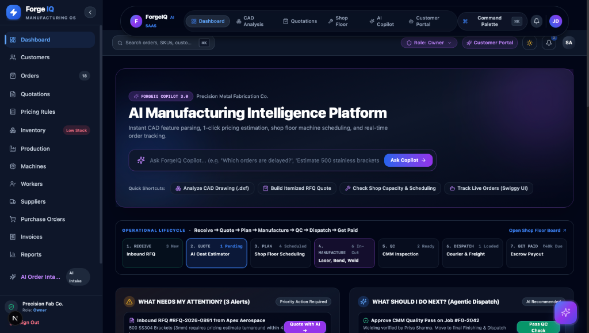
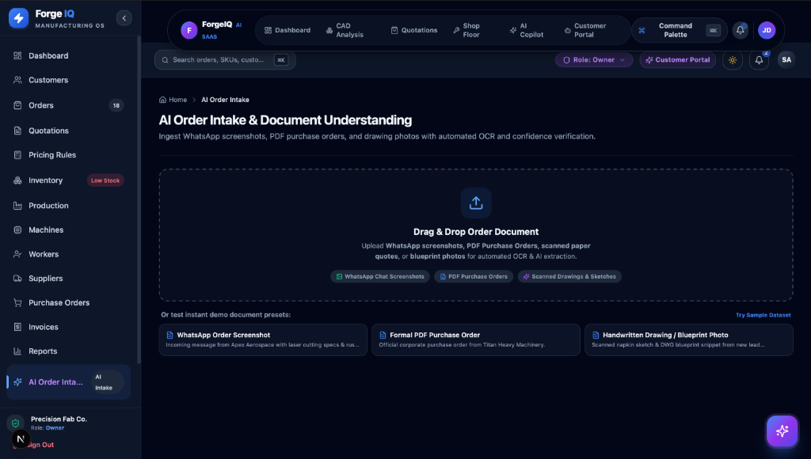
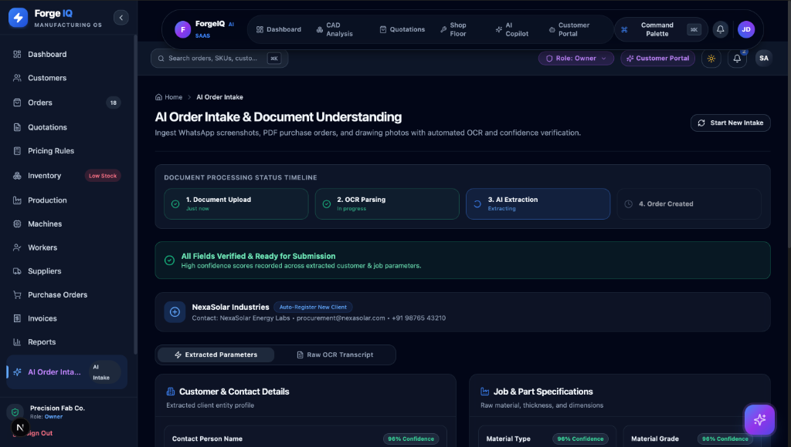
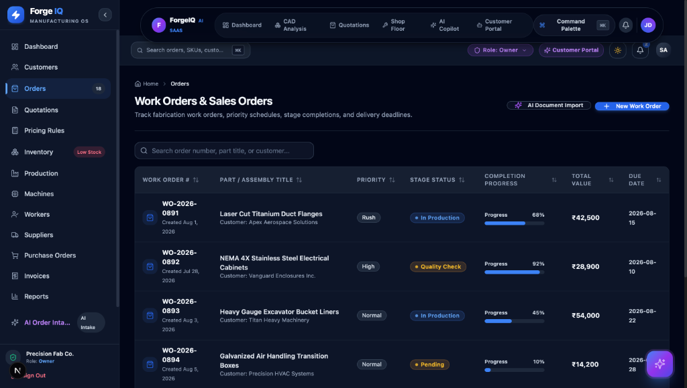
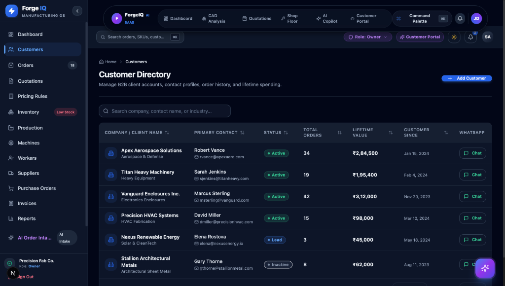
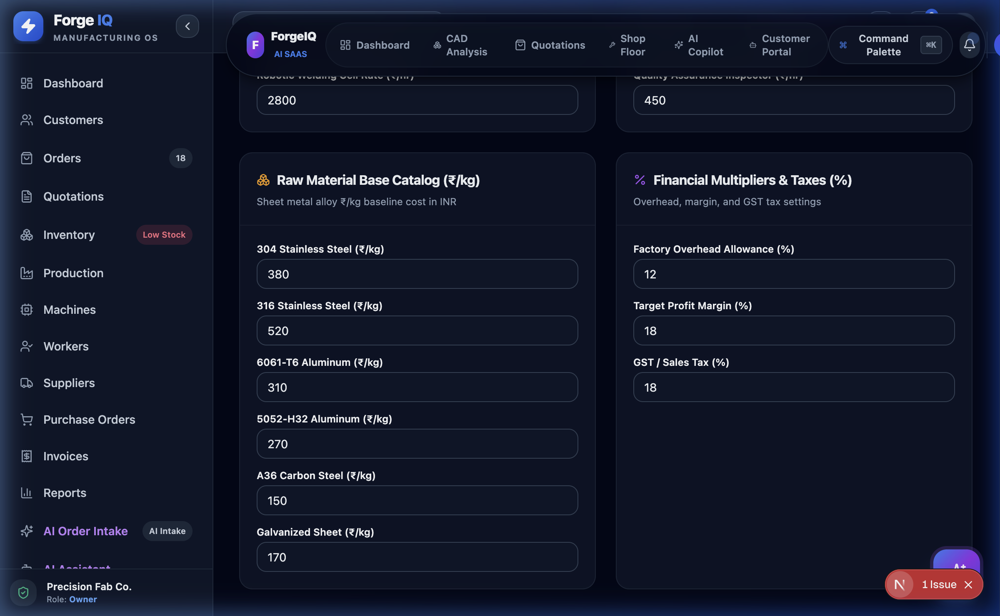
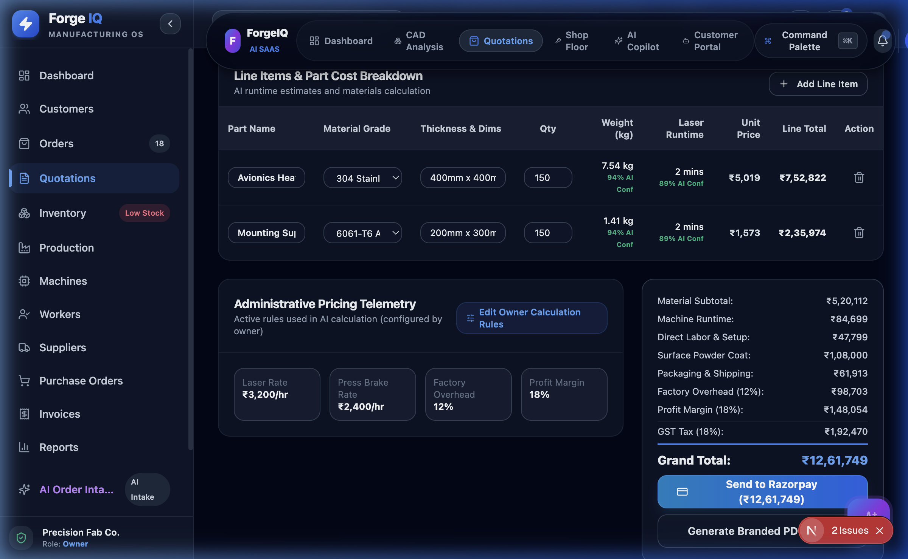
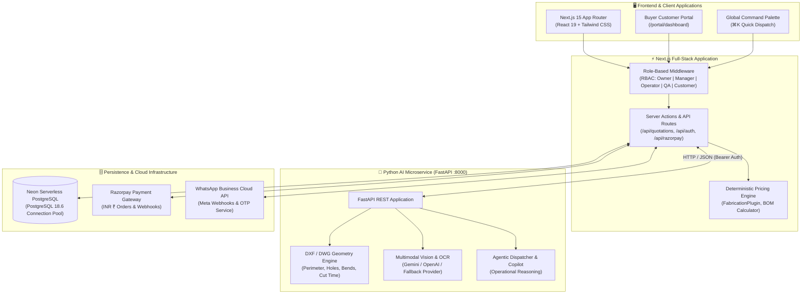

# ForgeIQ — Autonomous AI Manufacturing Intelligence & Commerce OS

<div align="center">

[](https://nextjs.org/)
[](https://react.dev/)
[](https://www.typescriptlang.org/)
[](https://fastapi.tiangolo.com/)
[](https://neon.tech/)
[](https://tailwindcss.com/)
[](https://razorpay.com/)
[](LICENSE)

<br />

**A full-stack agentic manufacturing enterprise operating system that automates the entire B2B fabrication lifecycle: from multimodal RFQ intake and instant CAD geometry costing to shop floor machine scheduling, real-time customer tracking, and Razorpay escrow payments.**

[Explore Features](#-feature-showcase--screenshots) • [System Architecture](#-system-architecture) • [Engineering Highlights](#-engineering-highlights) • [Getting Started](#-getting-started) • [API & Tests](#-testing--quality-assurance)

</div>

---

## 🌟 Executive Summary

Traditional precision manufacturing (sheet metal fabrication, CNC machining, additive manufacturing) is held back by slow manual processes:
- Estimators spend **hours to days** calculating laser cutting runtimes, bend sequences, scrap rates, and material costs from drawings.
- Buyer requests arrive fragmented across **WhatsApp chats, unstructured PDFs, and hand-drawn sketches**.
- Shop floors rely on **disjointed whiteboards and Excel sheets**, leading to delayed deliveries and blind spots.

**ForgeIQ solves this end-to-end.** Powered by a hybrid Next.js 15 + Python FastAPI AI architecture connected to a live Neon serverless PostgreSQL database, ForgeIQ transforms factory operations into an autonomous, transparent, and data-driven workflow.

---

## 📸 Feature Showcase & Screenshots

### 1. Executive Cockpit & Operational Lifecycle Board
> **Real-time factory telemetry, active revenue metrics, agentic recommendations, and 7-stage operational tracking (`Receive` ➔ `Quote` ➔ `Plan` ➔ `Manufacture` ➔ `QC` ➔ `Dispatch` ➔ `Get Paid`).**

<p align="center">
  
</p>

- **Agentic Dispatch Cards**: AI highlights critical path actions (e.g. *"Approve CMM Quality Pass on Job #FG-2042"* or *"500 SS304 Brackets RFQ needs quote response within 4 hours"*).
- **Interactive Lifecycle Pipeline**: Clickable operational stages with live WIP counts and escrow milestone tracking.
- **Unified Copilot Search & Command Palette (`⌘K`)**: Instant keyboard-driven navigation across orders, machines, and quotations.

---

### 2. Multimodal AI Order Intake & Document Understanding
> **Eliminating manual data entry. Drag & drop incoming customer WhatsApp messages, scanned purchase orders, or technical drawings.**

<p align="center">
  
</p>

- **Universal Document Support**: Accepts `.pdf`, `.png`, `.jpg`, `.dwg`, and `.dxf` formats with drag-and-drop or native file picker.
- **Built-in Demo Presets**: Includes realistic aerospace, heavy machinery, and solar manufacturing datasets for one-click testing.

---

### 3. Automated OCR & Multi-Agent Extraction Pipeline
> **Automated OCR parsing and entity extraction with statistical confidence scoring and instant customer profile auto-generation.**

<p align="center">
  
</p>

- **4-Stage Automated Pipeline**: `Document Upload` ➔ `OCR Parsing` ➔ `AI Extraction` ➔ `Order Created`.
- **Field Confidence Validation**: Visual confidence chips (e.g. `96% Confidence`) across material grade, sheet thickness, tolerances, and quantities.
- **Raw OCR Audit Trail**: Full transparency with side-by-side raw transcript inspection for quality control.

---

### 4. Work Orders & Production Execution
> **High-throughput fabrication job management with priority scheduling, dynamic progress tracking, and Rupee (₹) valuations.**

<p align="center">
  
</p>

- **Live Stage Status**: Instant filtering by `In Production`, `Quality Check`, `Pending`, and `Dispatched`.
- **Priority Tiering**: Color-coded badges for `Rush`, `High`, and `Normal` jobs linked directly to machine capacity.
- **Interactive Progression**: Real-time progress bars computed from sub-assembly milestone completions.

---

### 5. B2B Customer Directory & WhatsApp CRM
> **Direct customer relationship management with lifetime spending analytics, order history, and instant WhatsApp communication.**

<p align="center">
  
</p>

- **Instant WhatsApp Communication**: Integrated chat drawer with Meta WhatsApp Cloud API template dispatching and RFQ PDF attachments.
- **Financial Telemetry**: Track client lifetime spending (LTV), credit terms (e.g., `Net 30`), and active work orders.

---

### 6. Algorithmic Fabrication Pricing Engine (INR ₹)
> **Configure factory overheads, laser cutting hourly rates, CNC press brake rates, and material margins with live recalculation.**

<p align="center">
  
</p>

- **Machine Hourly Rates**: Independent machine rate matrices (e.g., Fiber Laser at ₹2,500/hr, CNC Press Brake at ₹1,800/hr).
- **Logistics & Tax Handling**: Configurable base packaging, weight-based logistics (₹12/kg), scrap rate compensation, and Indian GST (18%).

---

### 7. Quote Builder & Explainable Cost Breakdown
> **Generate auditable, itemized quotations with natural-language AI price explanations and instant PDF export.**

<p align="center">
  
</p>

- **Natural-Language AI Justification**: Translates complex machine feeds, speeds, and scrap formulas into plain English for client transparency.
- **Version Control & Revision History**: Create immutable snapshots (`v1.0`, `v1.1`) preserving pricing rules at time of quotation.

---

## 🏗️ System Architecture

ForgeIQ utilizes a distributed microservices and serverless architecture designed for performance, resilience, and horizontal scalability:



---

## 💡 Engineering Highlights

### 1. High-Performance Serverless Architecture
- **Next.js 15 App Router with React 19**: Leverages Server Components for zero-bundle-size database queries alongside optimized Client Components for high-interactivity features (CAD canvas, drag-and-drop uploader, interactive Gantt timelines).
- **Neon Serverless PostgreSQL**: Integrated via `@neondatabase/serverless` connection pooling. Includes automated health telemetry at `/api/database/neon/status` returning real-time database version and transaction ping.

### 2. Dual-Engine AI Architecture (Next.js + Python FastAPI)
- **FastAPI Microservice**: Dedicated Python backend (`ai-service/`) executing compute-heavy geometric computations, DXF entity parsing, and vector embeddings.
- **Graceful Multi-Tier Fallback**: Intelligent fallback hierarchy across Google Gemini, OpenAI, Anthropic, and realistic deterministic mock engines—ensuring 100% platform uptime even during external API downtime.

### 3. Enterprise Role-Based Access Control (RBAC)
Granular permissions enforced through Next.js middleware across 5 distinct personas:
| Role | Capabilities | Primary Route |
| :--- | :--- | :--- |
| **Owner** | Full administrative control, billing, pricing rules, factory settings | `/dashboard`, `/settings` |
| **Plant Manager** | Machine scheduling, production oversight, order dispatch | `/production`, `/machines` |
| **Operator** | Shift tasks, step-by-step digital traveler, scrap recording | `/production`, `/workers` |
| **QA Inspector** | CMM dimensional reports, quality approval, rework routing | `/orders`, `/reports` |
| **Customer** | Self-service tracking, drawing vault, quote approval, payment | `/portal/dashboard` |

### 4. Production Payment & Escrow Workflow (INR ₹)
- Native Indian Rupee (₹) denomination tailored for modern Indian manufacturing hubs (Peenya, Pune, Coimbatore, Sanand).
- **Razorpay Integration**: End-to-end checkout with automated order creation, cryptographic HMAC-SHA256 signature verification, and escrow disbursal calculation.

---

## 🛠️ Complete Tech Stack

| Layer | Technology | Purpose |
| :--- | :--- | :--- |
| **Frontend Framework** | **Next.js 15.5.23** | React Server Components, App Router, Nested Layouts |
| **UI Library** | **React 19.0** | Modern concurrency, hooks, transitions |
| **Language** | **TypeScript 5.7** | Strict type safety across all frontend and API layers |
| **Styling** | **Tailwind CSS 3.4** | Custom industrial dark-mode glassmorphism design system |
| **AI Microservice** | **Python 3.11 + FastAPI** | Asynchronous CAD geometry analysis and OCR parsing |
| **Database** | **Neon PostgreSQL 18** | Serverless SQL with connection pooling and SSL encryption |
| **Data Tables** | **@tanstack/react-table** | Virtualized sorting, pagination, and multi-column filtering |
| **Charts & Data Viz** | **Recharts** | Dark-mode accessible manufacturing KPIs and capacity graphs |
| **Payment Gateway** | **Razorpay** | Secure ₹ (INR) online transactions and webhook callbacks |
| **Testing** | **Pytest + Next.js E2E** | Automated microservice unit tests and scenario suites |

---

## 🚀 Getting Started

### Prerequisites
- **Node.js**: `v18.18.0` or higher (`v20.x` LTS recommended)
- **Python**: `3.10` or higher
- **npm** or **pnpm**

### Step-by-Step Local Setup

1. **Clone the repository:**
   ```bash
   git clone https://github.com/bhuvanabcs24-maker/Forge-IQ.git
   cd ForgeIQ
   ```

2. **Install Node dependencies:**
   ```bash
   npm install
   ```

3. **Configure Environment Variables:**
   Copy `.env.example` to `.env.local`:
   ```bash
   cp .env.example .env.local
   ```
   *The application includes pre-configured fallback providers, so you can immediately explore without requiring external API keys.*

4. **Start the Python AI Service (Terminal 1):**
   ```bash
   cd ai-service
   python3 -m venv .venv
   source .venv/bin/activate
   pip install -r requirements.txt
   uvicorn app.main:app --host 127.0.0.1 --port 8000 --reload
   ```
   *Interactive Swagger Documentation: [http://localhost:8000/docs](http://localhost:8000/docs)*

5. **Start the Next.js Web Application (Terminal 2):**
   ```bash
   npm run dev
   ```
   *The platform is now live at [http://localhost:3000](http://localhost:3000)*

---

## 🧪 Testing & Quality Assurance

ForgeIQ includes automated test suites covering both the frontend compilation and the Python AI microservice:

```bash
# 1. Run Next.js TypeScript validation & production build
npm run build

# 2. Run Python AI microservice test suite (FastAPI endpoints, CAD parsing, pricing math)
PYTHONPATH=ai-service ai-service/.venv/bin/pytest ai-service/tests/ -v

# 3. Test live Neon database connectivity
curl http://localhost:3000/api/database/neon/status

# 4. Trigger end-to-end 7-stage manufacturing lifecycle simulation
curl http://localhost:3000/api/testing/e2e-journey
```

---

## 🗺️ Key Application Routes

| Experience | Route | Key Functionality |
| :--- | :--- | :--- |
| **Platform Gateway** | `/` | Role switcher, capability showcase, unified landing |
| **Executive Dashboard** | `/dashboard` | Machine utilization, revenue charts, agentic alerts |
| **AI Order Intake** | `/ai-order-intake` | Drag-and-drop multimodal document extraction |
| **CAD Analysis** | `/cad-analysis` | 2D/3D geometry viewer, bend detection, cut time estimator |
| **Quotation Builder** | `/quotations/builder` | Live BOM calculation, margin sliders, PDF generation |
| **Pricing Rules** | `/settings/pricing-rules` | Custom administrative hourly rates and INR parameters |
| **Production Planner** | `/production/planner` | Interactive Gantt schedule, machine queue management |
| **Customer Portal** | `/portal/dashboard` | Client order status, milestone photos, quote approval |
| **Live Database Status**| `/settings` (Neon Tab) | Real-time PostgreSQL pooler latency & version check |

---

## 👤 Author

**Bhuvan A B**
- **Institution**: B.M.S. College of Engineering (BMSCE)
- **Email**: bhuvanab.cs24@bmsce.ac.in
- **GitHub**: [@bhuvanabcs24-maker](https://github.com/bhuvanabcs24-maker)

---

## 📄 License

This project is licensed under the MIT License — see the [LICENSE](LICENSE) file for details.
